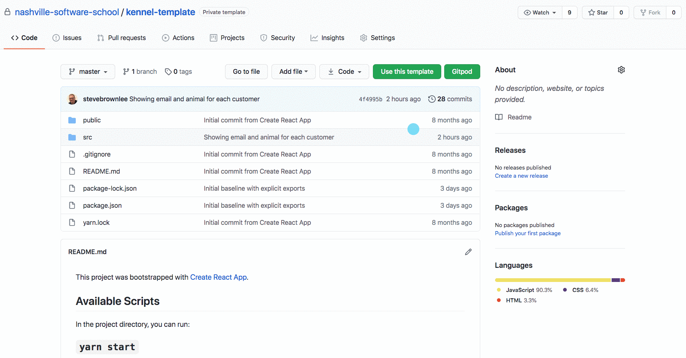

# Installations

## Visual Studio Code Extensions

Install these extensions to get your VS Code editor set up for writing Python code.

* [Pylance](https://marketplace.visualstudio.com/items?itemName=ms-python.vscode-pylance)
* [Python Extension Pack](https://marketplace.visualstudio.com/items?itemName=donjayamanne.python-extension-pack)
* [SQLTools](https://marketplace.visualstudio.com/items?itemName=mtxr.sqltools)
* [SQLTools: SQLite Driver](https://marketplace.visualstudio.com/items?itemName=mtxr.sqltools-driver-sqlite)
* [Python Test Explorer](https://marketplace.visualstudio.com/items?itemName=LittleFoxTeam.vscode-python-test-adapter)
* Watch the [Run Query Keyboard Shortcut](https://www.youtube.com/watch?v=4_9QTLGUqko) video to set up a shortcut for use in the course.

## Python on WSL

Run the following two commands in Ubuntu terminal. Mac users skip to the next section.

```sh
sudo apt update

sudo apt install -y gcc make build-essential libssl-dev zlib1g-dev libbz2-dev libreadline-dev libsqlite3-dev wget curl llvm libncurses5-dev libncursesw5-dev xz-utils tk-dev libffi-dev liblzma-dev python-openssl python3 python3-pip
```

Then install Homebrew with this command.

```sh
/bin/bash -c "$(curl -fsSL https://raw.githubusercontent.com/Homebrew/install/HEAD/install.sh)"
```

## Python on Mac

First, install the XCode Command Line tools with the following command in your terminal.

```sh
xcode-select --install
```

## Install Pyenv

```bash
brew install pyenv
pyenv install 3.8.1
pyenv global 3.8.1
```

Now, when you check the version of Python with the command below, it should return 3.8.1.

```
python --version
```

### Troubleshooting pyenv on Mac

Add the following commands to your `zshrc` file in your home directory.

```sh
# Configure pyenv
export PYENV_ROOT="$HOME/.pyenv"
export PATH="$PYENV_ROOT/bin:$PATH"
export PATH="/home/linuxbrew/.linuxbrew/bin:$PATH"

if command -v pyenv 1>/dev/null 2>&1; then
  eval "$(pyenv init -)"
fi

export PYTHON_CONFIGURE_OPTS="--with-openssl=$(brew --prefix openssl)"
export CFLAGS="-I$(brew --prefix zlib)/include -I$(brew --prefix sqlite)/include -I$(brew --prefix bzip2)/include"
export LDFLAGS="-L$(brew --prefix zlib)/lib -L$(brew --prefix sqlite)/lib -L$(brew --prefix bzip2)/lib"
```

If try to run `pyenv install 3.8.1` and receive an error similar to the one below

```
BUILD FAILED (OS X 10.14.6 using python-build 20180424)

Inspect or clean up the working tree at /var/folders/r5/snljcx4x3dx8ccckm7hhdgy80000gn/T/python-build.20191008104728.34069 Results logged to /var/folders/r5/snljcx4x3dx8ccckm7hhdgy80000gn/T/python-build.20191008104728.34069.log
```

Run the following command in your terminal:

```sh
sudo installer -pkg /Library/Developer/CommandLineTools/Packages/macOS_SDK_headers_for_macOS_10.14.pkg -target /
```

After this is completed, try running `pyenv install 3.8.1` again

## Install Pipenv

This tool will manage 3rd party software that is needed for each of your projects.

```sh
pip3 install --user pipenv
```

### Troubleshooting Pipenv
If you get `command not found: pipenv` when trying to run pipenv:
* mac and linux
  * Open ~/.zshrc and add:
      ```
      export PIPENV_DIR="$HOME/.local"
      export PATH="$PIPENV_DIR/bin:$PYENV_ROOT/bin:$PATH"
      ```
* windows
  * First run `python -m site --user-site`
  * Copy what that returns, replacing `site-packages` with `Scripts`
  * In the control panel add what was copied to the path


## Orientation React Clients

### Nashville Kennels

Visit the [kennel-template](https://github.com/nashville-software-school/nashville-kennels-template) repository and click the **`Use this template`** button to get the React client copied to your Github account.



Then clone your repository into your workspace directory.


### Daily Journal

Visit the [daily-journal-template](https://github.com/nashville-software-school/daily-journal-react-template) repository and click the **`Use this template`** button to get the React client copied to your Github account.

Then clone your repository into your workspace directory.
