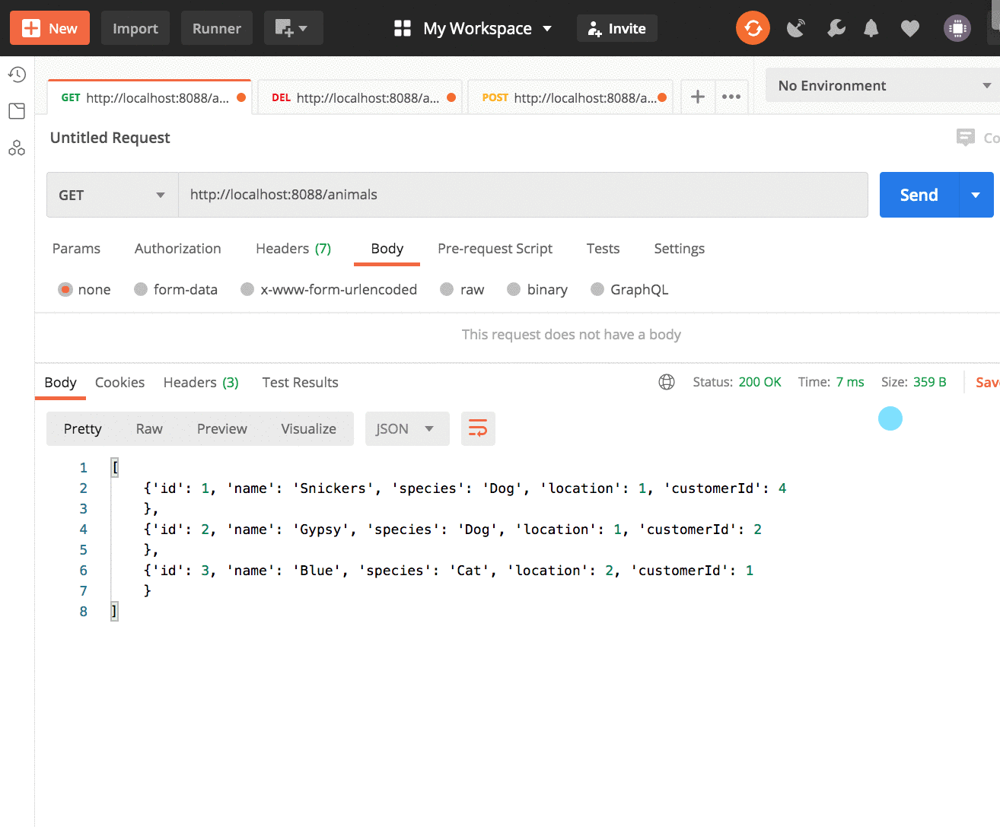

# Care Completed

When it's time for an animal to be picked up by their loving owner, you need to discharge the animal from the system. For this chapter, you will be implementing support for the DELETE method.

## Learning Objectives

* You should be able to implement and explain the benefit of using the `enumerate()` function with lists.
* You should be able to explain what the `pop()` method on list does.
* You should be able to describe the `204` HTTP status code.
* You should be able to explain the purpose of the DELETE verb in HTTP requests.

## Video Resources

* [Python Enumerate Function - Python Quick Tips](https://www.youtube.com/watch?v=-MZiQaNI0QA)
* [Pop() List Method In Python](https://www.youtube.com/watch?v=SUOX1-gMWPw)
* [HTTP Response Status Codes](https://youtu.be/F2WK9U64AGs?t=246) - Just watch the content for the 204 status code

## Handle DELETE Requests

A 204 response code in HTTP means, _"I, the server, successfully processed your request, but I have no information to send back to you."_

Add the method to the class to process the DELETE request. Note that the response code is set to 204 _(No Content)_ instead of 200 _(Ok)_ or 201 _(Created)_.

```py
def do_DELETE(self):
    # Set a 204 response code
    self._set_headers(204)

    # Parse the URL
    (resource, id) = self.parse_url(self.path)

    # Delete a single animal from the list
    if resource == "animals":
        delete_animal(id)

    # Encode the new animal and send in response
    self.wfile.write("".encode())
```

## Remove Animal Dictionary from the List

In the `animal_requests.py` module, add the following function.

```py
def delete_animal(id):
    # Initial -1 value for animal index, in case one isn't found
    animal_index = -1

    # Iterate the ANIMALS list, but use enumerate() so that you
    # can access the index value of each item
    for index, animal in enumerate(ANIMALS):
        if animal["id"] == id:
            # Found the animal. Store the current index.
            animal_index = index

    # If the animal was found, use pop(int) to remove it from list
    if animal_index >= 0:
        ANIMALS.pop(animal_index)
```

Make sure you import that function into `__init__.py`, and then import it from the package into `request_handler.py`.

## Initiate DELETE Request from Client

Time to try deleting an animal.

1. Open a new tab in Postman.
1. Set the method to `DELETE`.
1. Put in the following URL: http://localhost:8088/animals/2
1. Click the Send button.
1. The response code should be `204` and the response text area at the bottom should be blank.
1. Do another `GET` request to http://localhost:8088/animals to ensure that the animal was removed.



## Practice: Delete Locations, Employees and Customers

Add code to all required modules so that you support DELETE operations for the other resource types in your server.

