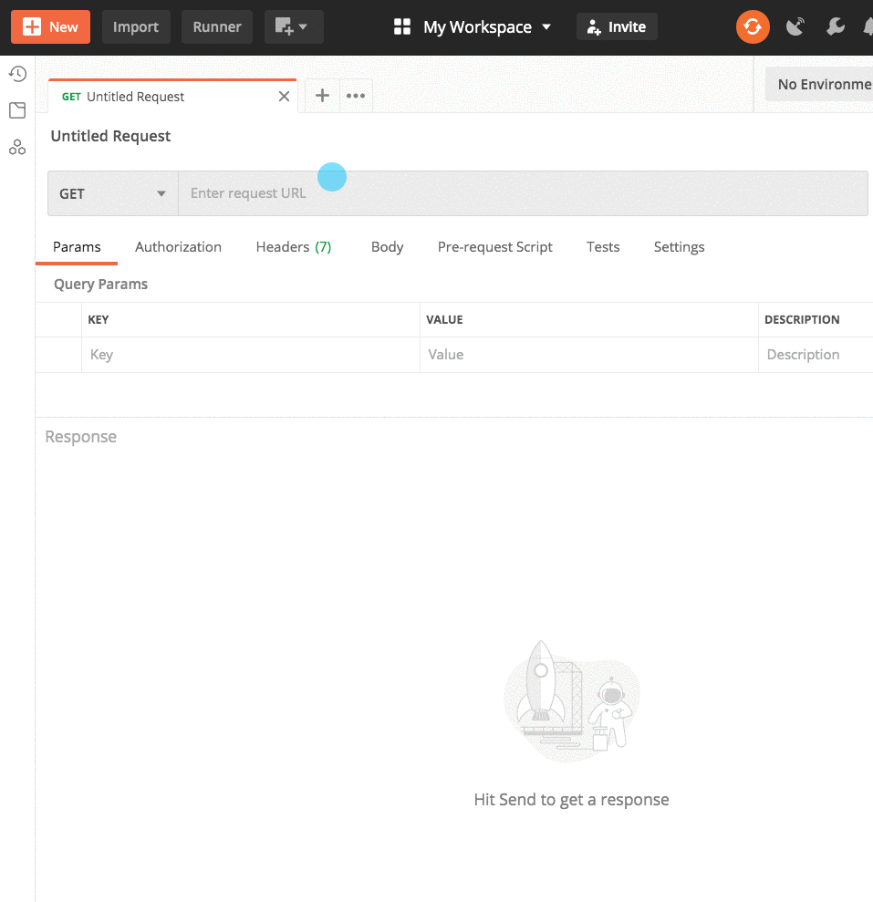

# Replacing json-server with Python

Oh no! The developer of `json-server` decided he didn't want to share his code any longer. This really stinks because all of your local project development was completely dependent on it to be the storage of your persistent data, and allowed you to request the data via `fetch()` calls.

Luckily, you know you have Python installed on your computer and you found a snippet of code on Stack Overflow that lets you start up your own, basic service that listens for HTTP requests on port 8088 - just like `json-server` did - and responds with data.

## Learning Objectives

1. You should be able to explain what a client and a server is in web development.
1. You should be able to explain what an HTTP status code is.
1. You should be able to explain the purpose of a 200 status code.
1. You should be able to explain the purpose of a 201 status code.
1. You should be able to explain the purpose of HTTP headers.
1. You should be able to identify a Python function.
1. You should be able to identify a Python `if` block.
1. You should be able to identify a Python list.
1. You should be able to identify a Python dictionary.
1. You should be able to explain the purpose and action of a Python `print()` function.
1. You should be able to explain that whitespace (i.e. indentation) defines scope in Python instead of `{}`.

## Video Resources

* [Parts of an HTTP Request](https://www.youtube.com/watch?v=pHFWGN-upGM)
* [Quick Intro to F-Strings in Python for String Formatting](https://www.youtube.com/watch?v=o0mvgsPQ8Jg)

## Directory and Code Setup

```sh
mkdir -p ~/workspace/python-server
cd ~/workspace/python-server
touch request_handler.py
```

Then copy pasta the following code into the `request_handler.py` file.

```py
from http.server import BaseHTTPRequestHandler, HTTPServer


# Here's a class. It inherits from another class.
# For now, think of a class as a container for functions that
# work together for a common purpose. In this case, that
# common purpose is to respond to HTTP requests from a client.
class HandleRequests(BaseHTTPRequestHandler):

    # Here's a class function
    def _set_headers(self, status):
        self.send_response(status)
        self.send_header('Content-type', 'application/json')
        self.send_header('Access-Control-Allow-Origin', '*')
        self.end_headers()

    # Another method! This supports requests with the OPTIONS verb.
    def do_OPTIONS(self):
        self.send_response(200)
        self.send_header('Access-Control-Allow-Origin', '*')
        self.send_header('Access-Control-Allow-Methods', 'GET, POST, PUT, DELETE')
        self.send_header('Access-Control-Allow-Headers', 'X-Requested-With, Content-Type, Accept')
        self.end_headers()

    # Here's a method on the class that overrides the parent's method.
    # It handles any GET request.
    def do_GET(self):
        # Set the response code to 'Ok'
        self._set_headers(200)

        # Your new console.log() that outputs to the terminal
        print(self.path)

        # It's an if..else statement
        if self.path == "/animals":
            # In Python, this is a list of dictionaries
            # In JavaScript, you would call it an array of objects
            response = [
                { "id": 1, "name": "Snickers", "species": "Dog" },
                { "id": 2, "name": "Lenny", "species": "Cat" }
            ]

        else:
            response = []

        # This weird code sends a response back to the client
        self.wfile.write(f"{response}".encode())

    # Here's a method on the class that overrides the parent's method.
    # It handles any POST request.
    def do_POST(self):
        # Set response code to 'Created'
        self._set_headers(201)

        content_len = int(self.headers.get('content-length', 0))
        post_body = self.rfile.read(content_len)
        response = f"received post request:<br>{post_body}"
        self.wfile.write(response.encode())


    # Here's a method on the class that overrides the parent's method.
    # It handles any PUT request.
    def do_PUT(self):
        self.do_POST()


# This function is not inside the class. It is the starting
# point of this application.
def main():
    host = ''
    port = 8088
    HTTPServer((host, port), HandleRequests).serve_forever()

if __name__ == "__main__":
    main()
```

## Supporting 3rd Party Software

Now you are going to install two tools:

1. **autopep8** - This is a Python linter (_a linter checks your code for syntax mistakes_).
1. **watchgod** - This will start your application, and then automatically restart it when you make changes to your code.

First, start a virtual environment. Virtual environments ensure that software that install for a project doesn't pollute your entire operating system. It keeps everything contained to the project.

```sh
pipenv shell
```

Once the virtual environment has started, you can install the 3rd-party software.

```sh
pipenv install autopep8 watchgod
```

## Starting python-server

Enter in the following command to start your new data server written in Python.

```sh
watchgod request_handler.main
```

If there are no errors in the code, you will see the following, terse output.

```sh
➜ watchgod request_handler.main
[09:34:37] watching "/Users/.../workspace/python-server" and reloading "request_handler.main" on changes...
```

## Requesting Animals via Postman

Now start Postman and request http://localhost:8088/animals and see what `python-server` responds with. You should get an array of two animal objects.

