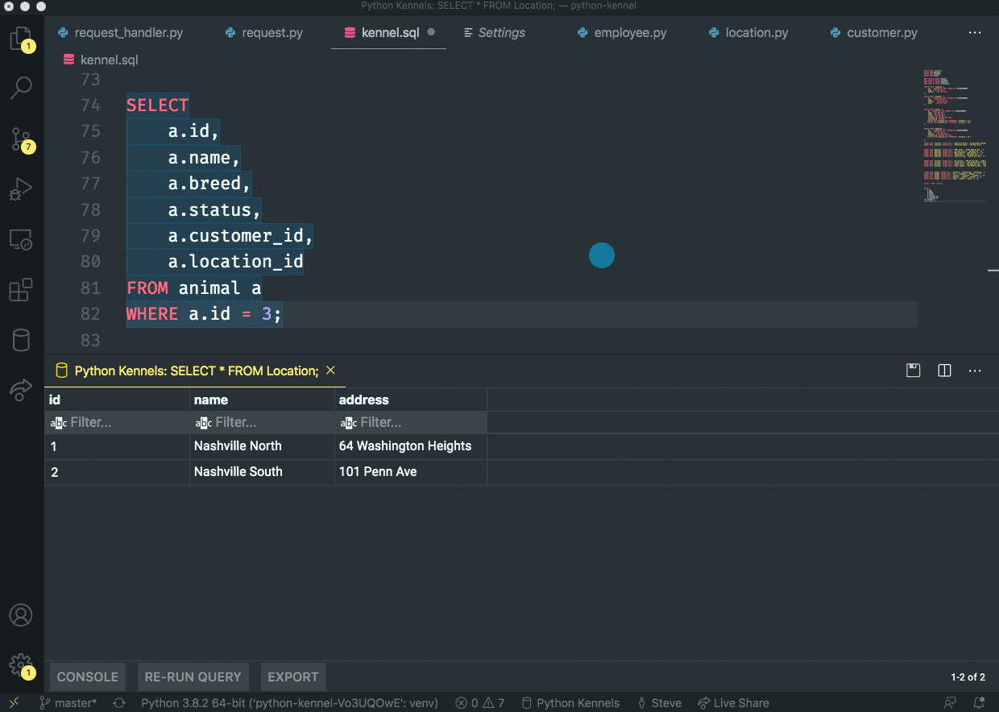

# Getting Animals from the Database


## Required Package from the Standard Library

```py
import sqlite3
import json
```

## Import the Database Model Class

```py
from models import Animal
```

## Get All Animals

```py
def get_all_animals():
    # Open a connection to the database
    with sqlite3.connect("./kennel.db") as conn:

        # Just use these. It's a Black Box.
        conn.row_factory = sqlite3.Row
        db_cursor = conn.cursor()

        # Write the SQL query to get the information you want
        db_cursor.execute("""
        SELECT
            a.id,
            a.name,
            a.breed,
            a.status,
            a.customer_id,
            a.location_id
        FROM animal a
        """)

        # Initialize an empty list to hold all animal representations
        animals = []

        # Convert rows of data into a Python list
        dataset = db_cursor.fetchall()

        # Iterate list of data returned from database
        for row in dataset:

            # Create an animal instance from the current row
            animal = Animal(row['name'], row['breed'], row['status'], row['location_id'], row['customer_id'])
            animal.id = row['id']

            # Use `json` package to properly serialize object as JSON
            animals.append(json.dumps(animal.__dict__))

    return animals
```

## Request all Animals from Postman

Open the Postman client and request all animals from http://localhost:8088/animals and verify that all five animals in the database get returned as JSON representations.


## Get Single Animal

The WHERE clause in SQL does the same job as `filter()` did for JavaScript arrays. It filters down all items in a table to one that pass a certain condition. For getting a single animal, the client passes the `id` of the animal as a route parameter.

You will use that value to filter down all rows in the Animal table to only those whose `id` field value is what the client specified. To do that, you use a SQL parameter, which you will notice is a question mark in the query below.

Then you need to add a second argument to the `execute()` method. That second argument is a tuple - `( id, )` - that contains the actual value to inject into the SQL statement where the question mark is.

Since you will only get one row returned, you will use the `fetchone()` method instead of `fetchall()`.

```py
def get_single_animal(id):
    # Open a connection to the database
    with sqlite3.connect("./kennel.db") as conn:
        conn.row_factory = sqlite3.Row
        db_cursor = conn.cursor()

        # Write the SQL query to get the information you want
        db_cursor.execute("""
        SELECT
            a.id,
            a.name,
            a.breed,
            a.status,
            a.customer_id,
            a.location_id
        FROM animal a
        WHERE a.id = ?
        """, ( id, ))

        data = db_cursor.fetchone()

        # Create an animal instance from the current row
        animal = Animal(data['name'], data['breed'], data['status'], data['location_id'], data['customer_id'])
        animal.id = data['id']

        return json.dumps(animal.__dict__)
```

If the client requests http://localhost:8088/animals/3, then the `id` parameter to the function will be `3`. In this case, the generate SQL will look like this.

```sql
-- Get only the animal rows where the `id` field value is 3
SELECT
    a.id,
    a.name,
    a.breed,
    a.status,
    a.customer_id,
    a.location_id
FROM animal a
WHERE a.id = 3
```

1. Copy pasta that statement into your `kennel.sql` file an execute it. You will get a single animal back.
2. Change the id in the SQL from 3 to some other number to query a different animal.



## Request Animal from Postman

Now request a single animal from the Postman client. In the animation below the animal with an id of 2 is requested, then the animals with an id of 3.

http://localhost:8088/animals/2

http://localhost:8088/animals/3


