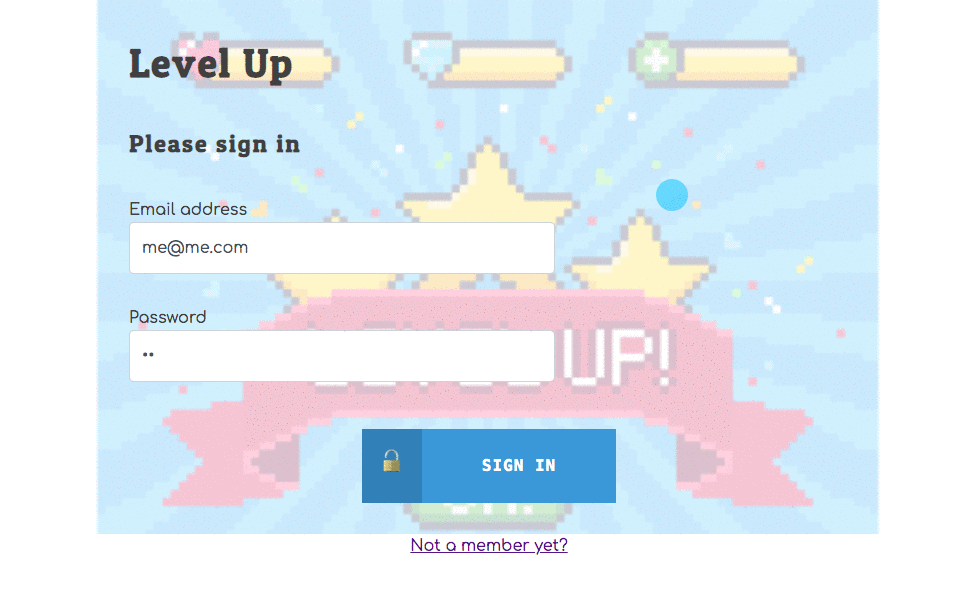

# Token Authentication with DRF

## Learning Objectives

* You should be able to identify an authentication token in an HTTP response.
* You should be able to clarify the purpose of an authentication token.
* You should be able to explain that an authentication token identifies a user, and not their primary key.
* You should be able to determine which routes, and which methods, are needed to enable authentication.

## Understanding Auth Tokens

Tokens are used by a server and its clients. When the user first registers on the client a unique token is created for that user. The client uses the token in all fetch calls to the server to identify the user making the request.  For your application, when a user fills out the registration form, the following process occurs:

1. Client sends a request to the server's `/register` route with the user's information in the body of the request.

1. Server extracts all of the information from the request and stores it in Python variables.

1. A record in the `User` table is created.

1. A record in the `Gamers` table is created.

1. A new Token is generated for the client by the server. That Token is unique to the user that was just created.

1. The Token is sent back to the client so that it can be used on future requests to identify the user. This way, the user doesn't have to keep filling out their username and password each time a new action is performed.

## Login and Register Functions

Create the following module in your API application. It is commented, so please read the logic once you have it created.

> #### `levelup-server/levelupapi/views/auth.py`

```py
from django.contrib.auth import authenticate
from django.contrib.auth.models import User
from rest_framework.authtoken.models import Token
from rest_framework.decorators import api_view, permission_classes
from rest_framework.permissions import AllowAny
from rest_framework.response import Response

from levelupapi.models import Gamer

@api_view(['POST'])
@permission_classes([AllowAny])
def login_user(request):
    '''Handles the authentication of a gamer

    Method arguments:
      request -- The full HTTP request object
    '''
    username = request.data['username']
    password = request.data['password']

    # Use the built-in authenticate method to verify
    # authenticate returns the user object or None if no user is found
    authenticated_user = authenticate(username=username, password=password)

    # If authentication was successful, respond with their token
    if authenticated_user is not None:
        token = Token.objects.get(user=authenticated_user)
        data = {
            'valid': True,
            'token': token.key
        }
        return Response(data)
    else:
        # Bad login details were provided. So we can't log the user in.
        data = { 'valid': False }
        return Response(data)

@api_view(['POST'])
@permission_classes([AllowAny])
def register_user(request):
    '''Handles the creation of a new gamer for authentication

    Method arguments:
      request -- The full HTTP request object
    '''

    # Create a new user by invoking the `create_user` helper method
    # on Django's built-in User model
    new_user = User.objects.create_user(
        username=request.data['username'],
        email=request.data['email'],
        password=request.data['password'],
        first_name=request.data['first_name'],
        last_name=request.data['last_name']
    )

    # Now save the extra info in the levelupapi_gamer table
    gamer = Gamer.objects.create(
        bio=request.data['bio'],
        user=new_user
    )

    # Use the REST Framework's token generator on the new user account
    token = Token.objects.create(user=gamer.user)
    # Return the token to the client
    data = { 'token': token.key }
    return Response(data)

```

## Views Package Imports

The `views` directory is going to become a package so that other modules can import the functions. We tell our code it should be a module by adding an `__init__.py` file to the directory.

Create the following file and place the code below in it.

> #### `levelup-server/levelupapi/views/__init__.py`

```py
from .auth import login_user, register_user
```

## Using Views Package to Make Routes

The last step is to establish some URL routes that any client application can use to register and login a gamer to use the API.

Completely replace the contents of the following file with the code below.

> #### `levelup-server/levelup/urls.py`

```py
from django.contrib import admin
from django.conf.urls import include
from django.urls import path
from levelupapi.views import register_user, login_user

urlpatterns = [
    path('register', register_user),
    path('login', login_user),
    path('api-auth', include('rest_framework.urls', namespace='rest_framework')),
    path('admin/', admin.site.urls),
]
```

In the code above, you will notice that the `register_user` and `login_user` functions are imported into the module. Then they are used to map a route to that view

```py
# Requests to http://localhost:8000/register will be routed to the register_user function
path('register', register_user)
# Requests to http://localhost:8000/login will be routed to the login_user function
path('login', login_user)
```

## Starting the Server

Run the following command in your `levelup-server` directory to start the Django application.

```sh
python3 manage.py runserver
```

## Authenticating a User

Now you can test this out as an actual Gamer who would be using the application. Launch your initial React client, and try to log in with the account that was created by your fixtures.

> Username is `Carrie1945`

> Password is `me`

Verify that you can log in and that the logout link takes you back to the log in screen.


