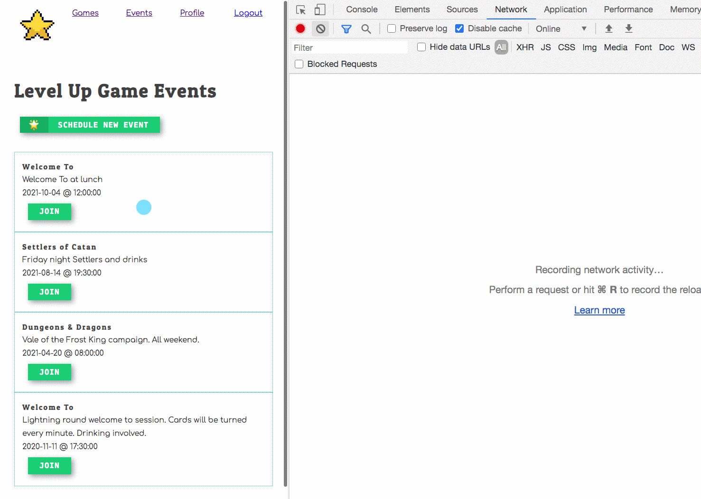

# Joining an Event

In this chapter, you are going to to allow gamers to sign up for an event that has been scheduled.



## Learning Objectives

* You should be able to remember that a custom action is a method on a ViewSet.
* You should be able to understand that a custom action allows the client to put a verb at the end of the URL to initiate a custom action.
* You should be able to remember that a custom action can specify which HTTP methods are supported by it.
* You should be able to create a custom action that includes the pk of object you want to retrieve from the database


## Custom Action

With Django REST Framework, you can create a custom action that your API must support by using the `@action` decorator above a method within a ViewSet. For this action, you want a client to create a request that allows a gamer to sign up for an event.

You also want to allow a client to allow a gamer to cancel their signup for an event.

This mean that your custom action needs to support `POST`, and `DELETE` verbs.

There are actually many ways to design this, and this chapter will show you one of them. You are going to support requests to the following URL.

http://localhost:8000/events/2/signup

The resource is `events`. The route parameter of `2` specifies which event is being targeted. The `signup` method at the end is your custom action.

## Signup Method

Add the following method to your event viewset.

> #### `levelup/levelupapi/views/event.py`

```py
@action(methods=['post', 'delete'], detail=True)
def signup(self, request, pk=None):
    """Managing gamers signing up for events"""
    # Django uses the `Authorization` header to determine
    # which user is making the request to sign up
    gamer = Gamer.objects.get(user=request.auth.user)

    try:
        # Handle the case if the client specifies a game
        # that doesn't exist
        event = Event.objects.get(pk=pk)
    except Event.DoesNotExist:
        return Response(
            {'message': 'Event does not exist.'},
            status=status.HTTP_400_BAD_REQUEST
        )

    # A gamer wants to sign up for an event
    if request.method == "POST":
        try:
            # Using the attendees field on the event makes it simple to add a gamer to the event
            # .add(gamer) will insert into the join table a new row the gamer_id and the event_id
            event.attendees.add(gamer)
            return Response({}, status=status.HTTP_201_CREATED)
        except Exception as ex:
            return Response({'message': ex.args[0]})

    # User wants to leave a previously joined event
    elif request.method == "DELETE":
        try:
            # The many to many relationship has a .remove method that removes the gamer from the attendees list
            # The method deletes the row in the join table that has the gamer_id and event_id
            event.attendees.remove(gamer)
            return Response(None, status=status.HTTP_204_NO_CONTENT)
        except Exception as ex:
            return Response({'message': ex.args[0]})
```

## Event Manager Method

In the event manager, create the function to be invoked when the current gamer wants to join a specific event. This request has everything the server needs to create the relationship.

1. The event via the `eventId` parameter
1. The user via the `Authorization` token

```js
export const joinEvent = eventId => {
    return fetch(`http://localhost:8000/events/${ eventId }/signup`, {
        method: "POST",
        headers:{
            "Authorization": `Token ${localStorage.getItem("lu_token")}`
        }
    })
        .then(response => response.json())
}
```

## Join and Leave Buttons

Now you need to update your **`EventList`** component in the client to allow the user to leave or join an event. Note that the `joinEvent()` function was added the the deconstructed object from the event context.

Then that function is invoked when the join button - which is on the bottom of each event card - is clicked.

```jsx
import React, { useEffect } from "react"
import { useHistory } from "react-router-dom"
import { getEvents, joinEvent } from "./EventManager.js"
import "./Events.css"

export const EventList = () => {
    const history = useHistory()
    const [ events, assignEvents ] = useState([])

    const eventFetcher = () => {
        getEvents()
            .then(data => assignEvents(data))
    }

    useEffect(() => {
        eventFetcher()
    }, [])

    return (
        <article className="events">
            <header className="events__header">
                <h1>Level Up Game Events</h1>
                <button className="btn btn-2 btn-sep icon-create"
                    onClick={() => {
                        history.push({ pathname: "/events/new" })
                    }}
                >Schedule New Event</button>
            </header>
            {
                events.map(event => {
                    return <section key={event.id} className="registration">
                        <div className="registration__game">{event.game.title}</div>
                        <div>{event.description}</div>
                        <div>
                            {event.date} @ {event.time}
                        </div>
                        <button className="btn btn-2"
                                onClick={
                                    () => {
                                        joinEvent(event.id)
                                            .then(() => eventFetcher())
                                    }
                                }
                        >Join</button>
                    </section>
                })
            }
        </article >
    )
}
```
