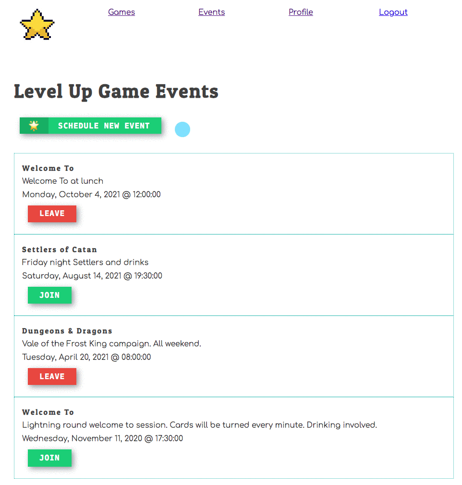

# Joining and Leaving Events

In the previous chapter, you implemented full-stack code that let an authenticated user join an event.

In this chapter, you are going to implement full-stack code that will allow gamers to easily join _**and**_ leave scheduled events. You will also implement reactive code that will immediately show if the user is currently attending the event or not.

You will learn about custom Django model properties, use a JavaScript ternary statement to show the correct UI element, use `onClick()` handlers in React, and implement a custom action - a feature available in Django REST Framework view sets.



## Learning Objectives

* You should be able to identify a custom property in a Django model class.
* You should be able to explain that a custom property exists on class instances, but is not a column in the database.
* You should be able to differentiate between a model property that maps to a column in the database and a custom property.
* You should be able to assign a value to a custom property in a View.
* You should be able to understand that using a Django ORM method _(e.g. `get()` or `all()`)_ never assigns a value to a model's custom properties.

## Custom Model Properties

Normally, every property on a Model class in Django directly reflects a column on a table in the database. Sometimes, though, you need additional properties on a model that are calculated during a request/response cycle with a client.

In this chapter, you are going to add a `joined` custom property to the **`Event`** class that will let the client application know if the currently authenticated user can join a particular event.

Assume there are 4 events.

A user has signed up for events #2 and #4.

When that user is authenticated, and the client requests a list of all events, the JSON would look like the representations below. Note the value of the `joined` property on each event. That data is not in the database, but rather calculated by the view logic and put in the JSON on the fly.

You'll see how later in the chapter.

```json
[
    {
        "id": 1,
        "game": {
            "title": "Welcome To"
        },
        "description": "Welcome To at lunch",
        "date": "2021-10-04",
        "time": "12:00:00",
        "joined": false
    },
    {
        "id": 2,
        "game": {
            "title": "Settlers of Catan",
        },
        "description": "Friday night Settlers and drinks",
        "date": "2021-08-14",
        "time": "19:30:00",
        "joined": true
    },
    {
        "id": 3,
        "game": {
            "title": "Dungeons & Dragons",
        },
        "description": "Vale of the Frost King campaign. All weekend.",
        "date": "2021-04-20",
        "time": "08:00:00",
        "joined": false
    },
    {
        "id": 10,
        "game": {
            "title": "Welcome To",
        },
        "description": "Lightning round welcome to session. Cards will be turned every minute. Drinking involved.",
        "date": "2020-11-11",
        "time": "17:30:00",
        "joined": true
    }
]
````

## Model Property

Add the following custom property to event class. It's a simple property with get/set methods with no additional validation logic.

> #### `levelup/levelupclient/models/event.py`

```py
    @property
    def joined(self):
        return self.__joined

    @joined.setter
    def joined(self, value):
        self.__joined = value
```

## Event Serializer

Update the **`EventSerializer`** class to include the new, custom property.

```py
fields = ('id', 'game', 'organizer',
          'description', 'date', 'time',
          'joined')
```

## List of Events

Update the list method in the event viewset with the code below.

```py
    def list(self, request):
        """Handle GET requests to events resource

        Returns:
            Response -- JSON serialized list of events
        """
        # Get the current authenticated user
        gamer = Gamer.objects.get(user=request.auth.user)
        events = Event.objects.all()

        # Set the `joined` property on every event
        for event in events:
            event.joined = None

            try:
                EventGamers.objects.get(event=event, gamer=gamer)
                event.joined = True
            except EventGamers.DoesNotExist:
                event.joined = False

        # Support filtering events by game
        game = self.request.query_params.get('gameId', None)
        if game is not None:
            events = events.filter(game__id=type)

        serializer = EventSerializer(
            events, many=True, context={'request': request})
        return Response(serializer.data)
```

## Event Provider Method

In the event provider, create the function to be invoked when the current gamer wants to join a specific event. This request has everything the server needs to remove the relationship.

1. The event via the `eventId` parameter
1. The user via the `Authorization` token

> **Note:** The `.then(getEvents)` method was also added to the promise chain for `joinEvent()`. Make sure you have that in your function.

```js
const leaveEvent = eventId => {
    return fetch(`http://localhost:8000/events/${ eventId }/signup`, {
        method: "DELETE",
        headers:{
            "Authorization": `Token ${localStorage.getItem("lu_token")}`
        }
    })
        .then(response => response.json())
        .then(getEvents)
}

const joinEvent = eventId => {
    return fetch(`http://localhost:8000/events/${ eventId }/signup`, {
        method: "POST",
        headers:{
            "Authorization": `Token ${localStorage.getItem("lu_token")}`
        }
    })
        .then(response => response.json())
        .then(getEvents)
}
```

## Join and Leave Buttons

Time for all of your hard work to pay off. You will now use the `joined` property on each event to display a Join button, or a Leave button on each event.

In React, you need to update your **`EventList`** component in the client to allow the user to leave or join an event. Note that the `leaveEvent()` function was added the the deconstructed object from the event context.

> **Vocabulary:** `condition ? what happens if true : what happens if false` is called a ternary statement in JavaScript. It's a condensed version of an `if..else` block of code that you can use in JSX, because interpolation only supports a single JavaScript statement.

```jsx
import React, { useContext, useEffect } from "react"
import { EventContext } from "./EventProvider.js"
import { useHistory } from "react-router-dom"
import "./Events.css"

export const EventList = () => {
    const history = useHistory()
    const { events, getEvents, joinEvent, leaveEvent } = useContext(EventContext)

    useEffect(() => {
        getEvents()
    }, [])

    return (
        <article className="events">
            <header className="events__header">
                <h1>Level Up Game Events</h1>
                <button className="btn btn-2 btn-sep icon-create"
                    onClick={() => {
                        history.push({ pathname: "/events/new" })
                    }}
                >Schedule New Event</button>
            </header>
            {
                events.map(event => {
                    return <section key={event.id} className="registration">
                        <div className="registration__game">{event.game.title}</div>
                        <div>{event.description}</div>
                        <div>
                            {event.date} @ {event.time}
                        </div>
                        {
                            event.joined
                                ? <button className="btn btn-3"
                                    onClick={() => leaveEvent(event.id)}
                                    >Leave</button>
                                : <button className="btn btn-2"
                                    onClick={() => joinEvent(event.id)}
                                    >Join</button>
                        }
                    </section>
                })
            }
        </article>
    )
}
```