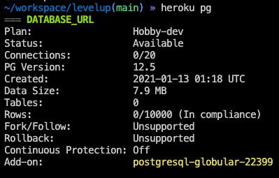

# Deploying with Heroku
Heroku is a cloud platform that lets companies build, deliver, monitor and scale apps. It's pretty simple to use for deploying your django application. Best of all, there's a free tier that will be powerful enough for what you'll need.

### Steps
1. Install heroku cli: https://devcenter.heroku.com/articles/getting-started-with-python#set-up
1. Create heroku account. You will want to use two factor authentication (TFA) when creating your account: https://signup.heroku.com/
2. Create application in heroku: https://dashboard.heroku.com/new-app
3. After you create the application, it should have some cli commands for you to run to connect your code to the application
4. There's a few extra packages you'll need to install `pipenv install gunicorn django_on_heroku`
5. And some lines to add in `settings.py`
```py 
STATIC_ROOT = os.path.join(BASE_DIR, 'staticfiles')
STATIC_URL = "/static/"

django_on_heroku.settings(locals())
```
4. Add a file called `Procfile` and paste in this line `web: gunicorn levelup.wsgi --log-file -`
1. Add and commit all the changes
1. To add code to the heroku server run: `git push heroku main`
1. Run `heroku open` and you should see the base rest framework unauthorized page
1. The next step is checking that a database was created. Run `heroku pg` and you should see something like this: 

1. Can't have a django project without tables so run `heroku run python manage.py migrate` The output should look similar to running it locally
1. You'll need to create your django superuser next `heroku run python manage.py createsuperuser` This is a live site so make sure to use a strong password
1. You should notice that all the normal `python manage.py .....` commands work as long as `heroku run` is at the beginning of the command. 
1. Now to load the fixture data onto your database. **DO NOT LOAD the users.json OR tokens.json!!!!!!!** There is the superuser with an id of 1 so the rest of your fixtures will still work
1. To create a token for the superuser log into `<your-url>.com/admin` with the superuser and click on `Tokens` on the left and add a token for the superuser.

### Using Postman

At this point you should be able to use Postman to get data from the database. 

Copy the token key you just created and add it to the Postman headers:


Copy the url heroku gave you into the url bar and try it out!


### Front end Deployment
Good news! Whatever you used to deploy during the front end will still work. You'll just need to update your API calls in react to use the deployed URL 
