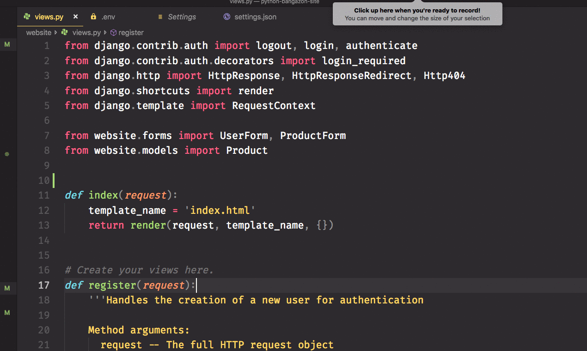

# Starting a Project

## Virtual Environment

```
python -m venv env
source ./env/bin/activate
pip install django
pip freeze > requirements.txt
```

## Environment Settings

Use the `pwd` command to get the absolute path to your current working directory. Copy the output. Then create a `.env` file in your workspace directory.

```sh
touch .env
```

Open that file in VS Code and put in the following code.

```sh
PYTHONPATH={paste your path here}
```

## Project Settings

### Windows

Open `.vscode/settings.json` and add the following code.

```json
{
    "python.pythonPath": "C:\python3.7.3",
    "python.envFile": "${workspaceFolder}/.env"
}
```

### OSX

Open `.vscode/settings.json` and add the following code. Replace `yourusername` with your computer login.

```json
{
    "python.pythonPath": "/Users/yourusername/.pyenv/versions/3.7.3/bin/python",
    "python.envFile": "${workspaceFolder}/.env"
}
```

## Selecting Interpreter

Use `Cmd+Shift+p` on OSX and `Ctrl+Shift+p` on Windows to open the command pallette. Type in `select interpreter` and choose that command. In the list of options it provides, choose the one that points to your local `env` directory.


