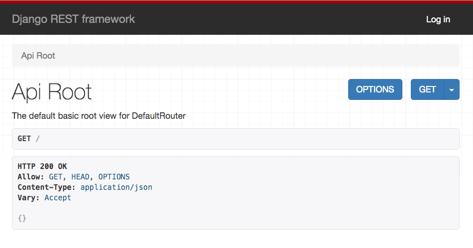

## API Application

Now that the project is set up and has some initial configuration, it's time to create your application for the API you are building.

```sh
python manage.py startapp kennywoodapi
```

Now you need to update your application settings to enable Django REST Framework, CORS headers, and your application. Replace the following section in your `settings.py` file with the code below.

> ##### `settings.py`

```sh
INSTALLED_APPS = [
    'django.contrib.admin',
    'django.contrib.auth',
    'django.contrib.contenttypes',
    'django.contrib.sessions',
    'django.contrib.messages',
    'django.contrib.staticfiles',
    'rest_framework',
    'rest_framework.authtoken',
    'corsheaders',
    'kennywoodapi',
]
```

## Basic Setup of Routing

Replace the contents of `kennywood/urls.py` with the following code. You will configure the routes for your application in the next chapter after you set up your first view.

```py
from django.conf.urls import url, include
from rest_framework import routers
from rest_framework.authtoken.views import obtain_auth_token

router = routers.DefaultRouter(trailing_slash=False)

urlpatterns = [
    url(r'^', include(router.urls)),
    url(r'^api-token-auth/', obtain_auth_token),
    url(r'^api-auth/', include('rest_framework.urls', namespace='rest_framework')),
]
```

## First Run

Now you can start the project and verify that everything was configured correctly.

```sh
python manage.py runserver
```

Then open the URL of `http://127.0.0.1:8000/` in your browser and you should see a web page with no errors on it. If you do see error, please visit the instruction team.


