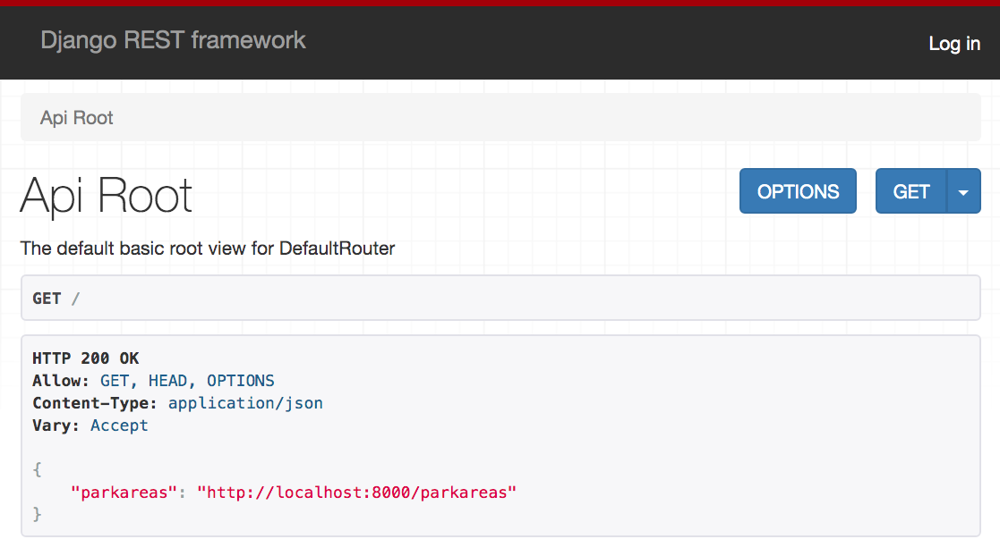
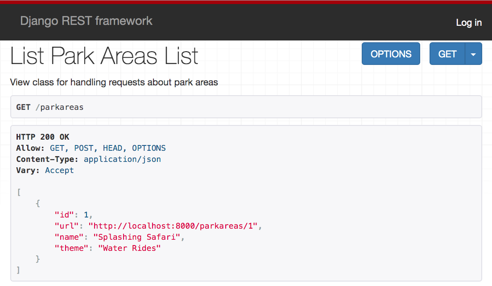

# Routing with DefaultRouter

Time to configure the `DefaultRouter` in the `url.py` module to accept incoming requests to `http://localhost:8000/parkareas` and direct those requests to your view module to be handled. The first thing you need to do is import your view into the module.

> ##### `kennywoodapi/urls.py`

```py
from kennywoodapi.views import ParkAreas
```

Then you need to set up the mapping between the URL and the ViewSet. Update your module with the following code.

> ##### `kennywoodapi/urls.py`

```py
router = routers.DefaultRouter(trailing_slash=False)
router.register(r'parkareas', ParkAreas, 'parkarea')
```

That's the last piece to see something in the browsable API in the browser.  Open http://localhost:8000 in your browser and you should see a URL for park areas.



Go ahead and click on the URL for the `"parkareas"` key and you should then see the list of park areas in your database. There's only the one for now.


