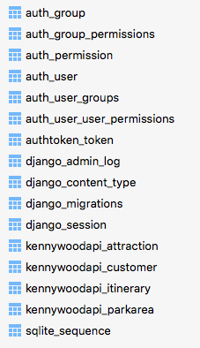

# Kennywood Models

## Defining Models Package and Modules

Next, create the `models` directory and the initial files that will contain the individual Models for the application.

```sh
mkdir models && cd $_
touch __init__.py customer.py attraction.py parkarea.py itinerary.py
echo 'from .customer import Customer
from .attraction import Attraction
from .itinerary import Itinerary
from .parkarea import ParkArea' >> __init__.py
```

## Kennywood Models

In this application, customers are going to build an itinerary of attractions that they want to visit at Kennywood. Each attraction is assgined to a specific area of the park, and each area has a particular theme.

> ##### `kennywoodapi/models/customer.py`

```py
from django.db import models
from django.db.models import F
from django.contrib.auth.models import User
from django.db.models.signals import post_save
from django.dispatch import receiver


class Customer(models.Model):

    user = models.OneToOneField(User, on_delete=models.CASCADE)
    family_members = models.IntegerField()

    def __str__(self):
        return f'{self.first_name} {self.last_name}'

    class Meta:
        ordering = (F('user.date_joined').asc(nulls_last=True),)
```

> ##### `kennywoodapi/models/parkarea.py`

```py
from django.db import models


class ParkArea(models.Model):
    name = models.CharField(max_length=50)
    theme = models.CharField(max_length=50)

    class Meta:
        ordering = ("theme",)

    def __str__(self):
        return self.name
```

> ##### `kennywoodapi/models/attraction.py`

```py
from django.db import models
from .parkarea import ParkArea

class Attraction(models.Model):

    name = models.CharField(max_length=50)
    area = models.ForeignKey(ParkArea, on_delete=models.DO_NOTHING)

    class Meta:
        ordering = ("area",)

    def __str__(self):
        return self.name
```

> ##### `kennywoodapi/models/itinerary.py`

```py
from django.db import models
from .customer import Customer
from .attraction import Attraction

class Itinerary(models.Model):

    attraction = models.ForeignKey(Attraction, on_delete=models.DO_NOTHING)
    customer = models.ForeignKey(Customer, on_delete=models.DO_NOTHING)
    starttime = models.IntegerField()

    class Meta:
        ordering = ("starttime")
        verbose_name = ("itinerary")
        verbose_name_plural = ("itineraries")

    def __str__(self):
        return f'Riding {self.attraction.name} at {self.starttime}'
```

## Updating Database with Migration

Now that the models are set up, it's time to use them to create your tables in the database. The first step is to import all the models into the `urls.py` module. Add the following import statement.

> ##### `kennywood/urls.py`

```py
from kennywoodapi.models import *
```

Then create a migration in the terminal.

```py
python manage.py makemigration
```

Once the migration is created, you run it to create the tables.

```py
python manage.py migrate
```

Once that process is complete, connect to your database in your management tool (TablePlus, DBeaver, etc.) and you should see the following tables. Notice that Django prepended each of your table names with `kennywoodapi_`.



Now move on to the next chapter and set up your first view that will handle requests to list your data.